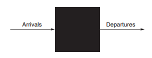

# D.3 真正的错误与失败的定义和例子

尽管人们可能愿意忍受一台偶尔死机并迫使所有程序重新启动的电脑，但他们坚持认为自己的信息永远不会丢失。无论发生什么，存储的首要指令就是记住信息。

第1章涵盖了可靠性的基础知识，本节扩展了相关信息，给出了标准定义和故障示例。

第一步是澄清对术语的混淆。术语故障、错误和失败通常可以互换使用，但它们在可靠性文献中具有不同的含义。例如，编程错误是故障、错误还是失败?我们讨论程序是什么时候设计的还是什么时候运行的有关系吗?如果运行的程序没有执行错误，它仍然是一个故障/错误/失败吗?试试另一个。假设一个粒子击中了DRAM存储单元。如果它没有改变值，这是一个错误/错误/失败吗?它是一个故障/错误/失败，如果内存不访问改变位?如果内存有错误纠正并将纠正的值传递给CPU，是否仍然发生故障/错误/失败?你明白了困难的含义。显然，我们需要精确的定义来明智地讨论这些事件。

为了避免这种不精确，本小节基于Laprie\[1985]和Gray and Siewiorek\[1991]使用的术语，并得到了IFIP工作组10.4和IEEE计算机协会容错技术委员会的认可。我们将系统视为单个模块，但该术语递归地适用于子模块。让我们从可靠性的定义开始:

计算机系统的可靠性是指所提供服务的质量，使人们可以合理地依赖于这项服务。系统交付的服务是与该系统的用户交互的其他系统感知到的观察到的实际行为。每个模块还具有理想的指定行为，其中服务规范是对预期行为的商定描述。当实际行为偏离指定行为时，系统会发生故障。故障的发生是由于一个错误，一个模块的缺陷。错误的原因是故障。

当故障发生时，它会产生一个潜在的错误，当它被激活时，它就会生效；当错误实际影响到交付的服务时，就发生故障。发生错误和导致失败之间的时间称为错误延迟。因此，错误是系统故障的表现，而失败是错误在服务上的表现。\[p. 3]

让我们回到上面的激励例子。编程错误就是错误。其结果是软件中的错误(或潜在错误)。激活后，错误生效。当此有效错误产生影响所交付服务的错误数据时，就会发生故障。

α粒子撞击DRAM可被视为故障。如果它改变了内存，就会产生错误。在读取受影响的内存字之前，错误将保持潜伏状态。如果有效字错误影响到交付的服务，则发生故障。如果ECC纠正了错误，则不会发生故障。

操作员的错误是错误。结果改变的数据是错误的。它是潜伏的，直到被激活，依此类推。

为了之后的讨论更加清晰，故障、错误和失败之间的关系如下:

* 一个错误会产生一个或多个潜在错误。
* 误差的性质是:(1)潜在误差一旦被激活就会生效；(2)误差可能在潜在状态和有效状态之间循环；(3)有效误差经常从一个分量传播到另一个分量，从而产生新的误差。因此，有效误差要么是该组件中先前潜在的误差，要么是从该组件或其他地方的另一个误差传播过来的。
* 当错误影响到交付的服务时，将发生组件故障。
* 这些属性是递归的，适用于系统中的任何组件。

Gray和Siewiorek根据原因将断层分为四类：

1. 硬件故障——设备故障，比如可能是由于粒子击中了存储单元
2. 设计错误——软件(通常)和硬件(偶尔)设计错误
3. 操作类故障—操作维护人员的失误
4. 环境故障——火灾、洪水、地震、电力故障和破坏

故障根据其持续时间分为短暂性、间歇性和永久性\[Nelson 1990]。暂态故障存在的时间有限，不会重复发生。间歇故障导致系统在故障运行和无故障运行之间来回切换。永久的故障不会随着时间的流逝而自我纠正。

既然我们已经定义了故障、错误和失败之间的区别，我们就可以看一些现实世界的例子了。关于实际错误率的出版物很少，原因有二。首先，学术界很少有机会获得重要的硬件资源来进行测量。其次，工业研究人员很少被允许发布失败信息，因为他们担心这些信息会在市场上被用来对付他们的公司。但以下是一些例外。

#### 伯克利三级磁盘

2000年，加州大学的“三级磁盘”项目为旧金山美术博物馆创建了一个艺术图像服务器。该数据库包含超过70,000件艺术品的高质量图像\[Talagala et al .，2000]。数据库存储在一个集群中，该集群由20台pc机组成，通过交换以太网连接，包含368个磁盘。它占据了7个7英尺高的架子。

三级盘各部件故障率如图D.6所示。在构建系统之前，设计人员假定SCSI数据磁盘是系统中最不可靠的部分，因为它们既机械又丰富。接下来是IDE磁盘，因为它们较少，然后是电源，然后是集成电路。他们认为像电缆这样的无源设备几乎不会发生故障。

<figure><figcaption>
图D.6 三级盘部件运行18个月以上故障情况。对于每种类型的组件，表中显示了系统中的总数、失败数量和失败率百分比。硬盘框在表中有两个条目，因为它们有两种类型的问题:背板完整性故障和电源故障。由于每个机箱有两个电源，电源故障不会影响可用性。这个由20台个人电脑组成的集群，放在7个7英尺高、19英寸宽的机架上，托管着368个8.4 GB、7200转/分钟、3.5英寸的IBM磁盘。pc的频率为p6 ~ 200mhz，每台内存为96mb。它们运行的是FreeBSD 3.0，主机通过交换的100mbit /s以太网连接。所有SCSI磁盘都通过双端SCSI链连接到两台pc上，以支持RAID 1。主要的应用程序被称为Zoom项目，在1998年，它是世界上最大的艺术图像数据库，拥有72,000张图像。参见Talagala et al(2000b)。
</figcaption></figure>

图D.6打破了其中的一些假设。由于设计师遵循制造商的建议，确保磁盘外壳具有减少振动和良好冷却的功能，因此数据磁盘非常可靠。相比之下，包含IDE/ATA磁盘的PC机箱无法提供相同的环境控制。（IDE/ATA磁盘不存储数据，但帮助应用程序和操作系统启动pc)。图D.6显示SCSI背板、电缆和以太网电缆并不比数据磁盘本身更可靠!

由于三级磁盘是一个具有许多冗余组件的大型系统，因此它可以在这种大范围的故障中存活下来。连接了组件并放置了镜像映像，这样就不会出现单个故障导致任何映像不可用。这一策略起初似乎有些矫枉过正，但后来证明是至关重要的。

这一经验也证明了瞬态故障和硬故障之间的区别。实际上，图D.6中的所有故障首先都是瞬态故障。操作员可以决定这种行为是否糟糕到需要更换，或者是否可以继续。事实上，没有使用“失败”这个词；相反，该小组借用了通常用于处理问题员工的术语，由操作员决定是否应该“解雇”问题组件。

#### Tandem

下一个例子来自工业界。Gray\[1990]为Tandem Computers收集故障数据，Tandem Computers是容错计算的先驱公司之一，主要用于数据库。图D.7以每个系统的绝对故障数和故障所占百分比表示了1985年至1989年间导致系统故障的故障图。数据显示硬件的可靠性和维护方面有了明显的提高。1985年的磁盘需要Tandem每年维护一次，但它们被不需要定期维护的磁盘所取代。每个系统的芯片和连接器数量的减少，加上软件对硬件故障的容忍度的提高，到1989年，硬件对故障的贡献减少到只有7%。此外，当硬件出现故障时，嵌入在硬件设备(固件)中的软件往往是罪魁祸首。数据显示，1989年软件是报告中断的主要来源(62%)，其次是系统操作(15%)。

任何此类统计数据的问题在于，这些数据只涉及报道的内容；例如，由于停电造成的环境故障没有报告给Tandem，因为它们被视为当地问题。操作失误的数据很难收集，因为操作员必须报告个人失误，这可能会影响管理者的意见，进而影响工作保障和加薪。Gray认为环境故障和操作人员故障都被低估了。他的研究得出结论，实现更高的可用性需要改进软件质量和软件容错能力，简化操作，以及对操作错误的容错能力。

<figure><figcaption>
图D.7 1985 ~ 1989年Tandem故障。Gray[1990]根据客户的组件故障报告为容错串联计算机收集了这些数据。
</figcaption></figure>

#### 操作员在可靠性中的作用的其他研究

虽然三级磁盘和Tandem是面向存储的可靠性研究，但我们需要从存储之外寻找更好的方法来衡量人类在故障中所起的作用。Murphy和Gent\[1995]试图通过让系统在每次启动时自动提示操作员重新启动的原因来提高数据的操作故障数据的准确性。他们将连续崩溃归为与操作人员故障相同的故障，并包括直接导致崩溃的操作人员操作，例如给出错误的参数值、错误的配置和错误的应用程序安装。尽管他们认为操作员的错误被低估了，他们确实比Gray得到了更准确的信息，Gray依靠的是操作员填写的表格，然后发送到管理链上。在VAX系统中，硬件/操作系统造成的故障从1985年的70%上升到1993年的28%，而操作员造成的故障在同一时期从15%上升到52%。Murphy和Gent预计管理系统将是未来主要的可靠性挑战。

最后一组数据来自政府。美国联邦通信委员会(FCC)要求所有电话公司在遇到影响至少3万人或持续30分钟的中断时提交解释。这些详细的中断报告不受早期数据的自我报告问题的影响，因为调查人员确定中断的原因，而不是设备的操作员。Kuhn\[1997]研究了1992年至1994年停电的原因，Enriquez\[2001]在2001年上半年进行了后续研究。尽管多年来由于网络过载导致的故障有了显著的改善，但由于人为原因导致的故障增加了，从大约三分之一增加到三分之二的客户中断时间。

这四个例子和其他例子表明，当今大型系统故障的主要原因是人为操作人员的故障。由于系统中芯片数量的减少和连接器的减少，硬件故障有所减少。通过内存ECC和RAID等容错技术，硬件可靠性得到了提高。至少有些操作系统在添加新功能之前会考虑可靠性问题，因此2011年的故障主要发生在其他地方。

尽管故障可能是由操作人员的错误引起的，但维护和升级过程如此容易出错，这是对系统技术水平的不良反映。如今，大多数存储供应商都声称，客户在存储的整个生命周期中，花在管理存储上的钱要比花在购买存储上的钱多得多。因此，未来可靠的存储系统面临的挑战是，要么容忍操作员的故障，要么通过简化系统管理任务来避免故障。请注意，即使操作人员错误地更换了一块好磁盘，RAID6也允许存储系统存活。

我们现在已经涵盖了可靠性的基本问题，给出了定义、案例研究和改进它的技术。存储之旅的下一步是性能。

